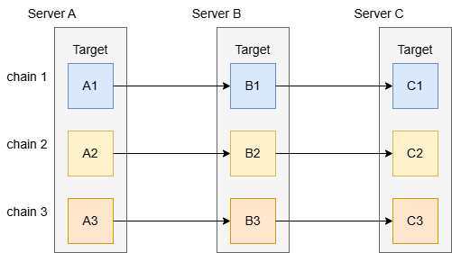
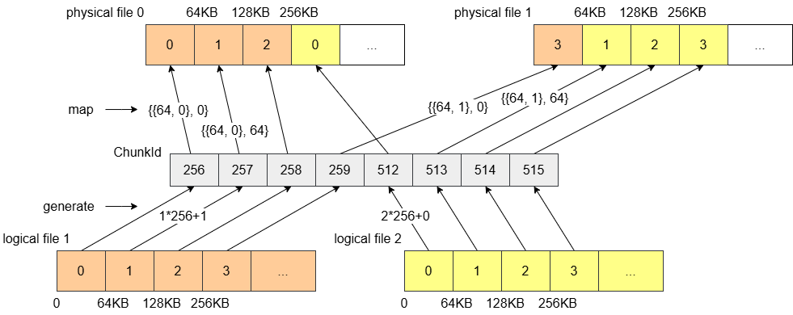
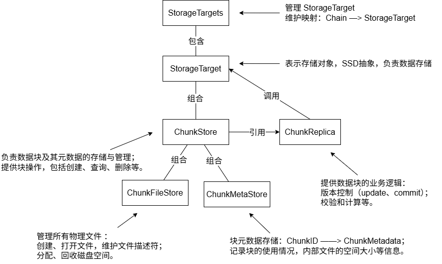

# 存储结构

### 块存储
一个逻辑文件划分为多个块，以块为单位进行存储，每个块用一个 ChunkId 进行标识。
ChunkId 作为 3FS 文件系统中一个块的唯一标识。

### 存储目标
存储服务器上的 SSD 会在逻辑上划分为多个 StorageTarget，StorageTarget 相当于 SSD 的抽象。一个 StorageTarget 只占用 SSD 的部分空间，StorageTarget 之间独立参与存储互不干扰。

StorageTarget 的数量取决于 SSD 参与几条复制链。

### 数据复制
每个块会在一条复制链上进行复制，复制链由多个 StorageTarget 组成。

假设现在有三个存储节点 A、B、C，每个节点只有一个 SSD，SSD 划分为三个 StorageTarget，用 1、2、3 标识。如果每个块有三个副本，那么形成的链结构如下图所示：

Q：对于节点上的每个 StorageTarget，需要放置在相同的位置吗？  
A：不需要。节点上每个 StorageTarget 独立组成链，可以自主选择位置，例如可以组成像 A1-->B1-->C1、B2-->C2-->A2、C3-->A3-->B3 这样的链结构。这种结构编排还具有分流写负载，提高写性能的效果。

**复制作用**   
数据备份，提供容错能力，防数据丢失；  
访问分流，支持并行读取，提高吞吐量。

### 存储映射

**逻辑文件**   
与用户交互的文件，只关注文件的操作和文件的内容。
需要指定一个块大小，划分文件为大小相同的块。

**物理文件**   
存储节点上保存的文件。节点上的每个 StorageTarget 会根据不同的块大小，创建 256（默认）个内部文件，用于存储来自不同逻辑文件的数据块。   

**文件路径与标识**   

ChunkFileId 是一个物理文件的唯一标识，由块大小和文件索引组成，文件索引默认 0-255。

**映射逻辑**  

逻辑文件会根据偏移量和块大小划分为大小相同的块，用 chunkIndex 标识；
文件系统会设置一些策略，将一个逻辑文件的块存储在不同的物理文件中；  

**注**：图中使用 16bits 表示 ChunkId，高位 8bit 用 InodeId 填充，低位 8bit 用 chunkIndex 表示。实际系统中是使用两个64bits的整数表示。

**I/O 优化**     
利用 SSD 并行读写的特性，当操作文件多个块时，可以同时对多个物理文件进行并行读写，提高 I/O 效率。   

### 存储分配
**磁盘空间预分配**  
当初次分配或者文件存储空间不足时，会使用 Fallocate 进行磁盘空间的预分配，一次性分配一个 256MB（默认）的磁盘空间。   
预分配可以减少磁盘空间分配的次数，提高写入性能。

**磁盘空间回收**  
删除的块会被系统回收利用。系统会记录被删除块在内部文件中的位置，当需要分配存储空间给新块时，会优先使用这些空闲位置放置新块。

### 数据结构
存储系统的数据结构如下所示：

对于块元数据的存储引擎使用的是 levelDB，里面使用了一些优化技巧，后续讨论。