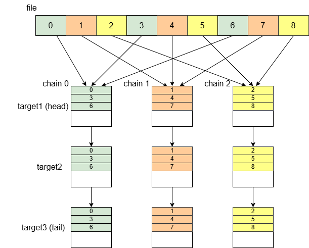

# 文件结构
3FS 跟大多数分布式文件系统一样，将文件分为元数据与块存储两个部分。元数据由元数据服务器集群提供服务，块存储由存储服务器集群提供服务。

## 元数据服务
负责管理文件系统的元数据信息，为用户提供文件系统语义的实现。这些元数据是描述文件和目录的属性和结构的数据，不包含文件的实际内容。

### 元数据存储
与 Linux 文件系统基本一致，3FS 使用 Inode 表示文件、目录、符号链接，使用 DirEntry 表示目录项。   

**Inode**  
Inode 由 InodeId 和 InodeData 组成。  
InodeId 是 Inode 编号，具有唯一性；  
InodeData 保存元数据，包括文件类型、访问权限、访问时间、修改时间、链接数等，如果是文件还包括大小、布局等信息。   

**DirEntry**  
DirEntry 由 Parent InodeId、Name 和 DirEntryData 组成。  
Parent InodeId 是父目录的 InodeId，用于定位、匹配父目录等；  
Name 是目录项的名称；  
DirEntryData 保存主要信息，包括目录项的InodeId、类型等。  

**Layout**  
Linux 文件元数据会存储指向文件数据的指针，用于定位文件数据。而 3FS 会将文件数据划分为大小相等的块，并条带化分布在在多个复制链上，因此定位数据块需要数据块大小、条带大小和链列表等元数据，这些元数据会保存在一个 Layout 结构中，Layout 就是 3FS 的数据指针。  

**FDB 存储**  
元数据存储在分布式数据库 FoundationDB 中。  
采用键值对的形式存储：  
Inode：key-> "INOD"(prefix) + InodeId，value -> InodeData。  
DirEntry：key-> "DENT"(prefix) + Parent InodeId + Name，value -> DirEntryData。  

可以看出，需要获得目录的所有目录项时，只需要给出目录的InodeId。

### 逻辑操作
处理文件元数据的操作，如创建、打开文件/文件夹、重命名等，只是在逻辑层面对文件进行重新组织，不影响数据的物理存储。  

逻辑操作会通过 FoundationDB 事务来实现，确保数据的一致性和原子性。 

**原子性保证**  
1、只读事务：用于元数据查询，如 stat、list 等操作。   
2、读写事务：用于元数据更新，如 create、rename、mkdirs 等操作。当检测到并发事务冲突时，元服务会自动重试事务，以保证文件系统元数据的一致性。  

### 文件系统语义
用户可以像操作本地文件系统一样操作分布式文件系统，用户只能感知到文件本身，而文件的存储方式和分布式实现是透明的。

## 块存储服务
负责实际文件数据的存储和管理，直接与物理存储设备 SSD 交互，为文件系统提供数据的持久化存储。

### 数据块存储
存储服务器管理着一个或者多个本地 SSD，SSD 上会创建一批物理文件（内部文件）用于存储数据块，物理文件就是数据块的存储载体。  

### 读写操作
存储服务器通过 CRAQ 协议组成多条复制链，读写操作使用 "write-all-read-any" 方式，写操作必须向链头节点发起，然后传播到尾节点，读操作可以对任意节点发起。  

### 数据放置
放置策略：条带化和复制链冗余。  
布局信息：Layout{chunkSize, stripeSize, chainList}。  

**获取 ChainId**   
条带化存储时，每个数据块需要分配一个存储节点放置数据，在3FS中是复制。一般会有两种分配方式：
1、由配置管理器分配，配置管理器记住所有块对应链的 chainId；  
2、由客户端通过算法策略计算得到。
3FS 采用的是第二种方式。先由配置管理器分配一批复制链，记录在文件的元数据布局信息的 chainList 中，然后根据 chunkIndex % stripeSize 得到的 chainId 分配链。  

数据块分布如下图所示：

条带化：文件被划分为大小相等的块，根据 chunkIndex，按照上述规则将各个块均匀分布在多条复制链上。每隔一个 stripeSize，块就会被放置到相同的复制链中，文件在存储节点上呈现条状分布。   
复制链冗余：为保证数据的容错性，每条复制链上会对分配到的块进行冗余复制，当某一数据块所在存储节点出现故障时，可从其他冗余副本快速恢复数据。  

**注**：复制链中使用的是 Target 而不是 Server，在《存储结构》分析中有介绍。  

## 总结
3FS 分离了文件的逻辑结构和物理存储。文件的逻辑结构由元数据提供，表现为虚拟/逻辑文件——用户看到和操作的文件；物理存储由存储节点实现，载体是物理文件——节点 SSD 上实际存在的文件，与逻辑文件概念相对应。