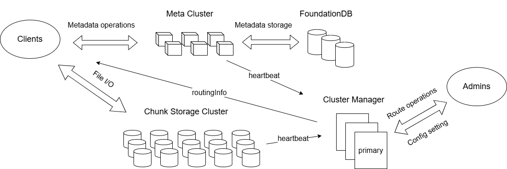
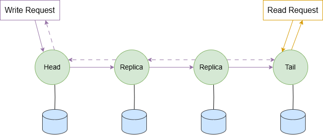
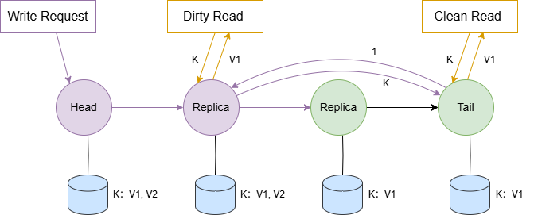

# 架构设计

### 存储服务
服务：由存储服务器集群提供；  
存储数据：文件数据块；    
存储位置：服务器本地 SSD；  
作用：为文件系统提供持久化存储。   

**存储设计**  
宏观上，采用条带化分配+复制链冗余的存储策略；微观上，进行 SSD 分区和多物理文件隔离。   
两种层面的存储设计，让系统具备优异的容错能力和并行读写性能。 

#### 数据复制与一致性保证
**Chain Replication（CR）协议**  

Write：由头节点处理，并沿着链向前传播；在尾节点提交，然后沿着链向后发送确认消息，头节点收到确认后发送响应。  
Read：由尾节点处理，然后发送响应。

**强一致性**  
读写操作是序列化的，读操作都在尾节点进行，可以保证读到最新的数据。

**Chain Replication with Apportioned Queries（CRAQ）协议**  

版本控制：维护一个版本列表（一个干净版本，多个脏版本）。  

Write：由头节点处理，并沿着链向前传播；请求到达的每个节点，生成一个脏版本；直到尾节点时，生成一个干净版本——最新的提交版本，然后沿着链向后发送确认消息；节点收到确认后，将脏版本转为干净版本，头节点会发送响应。  
Read：可以从任意节点进行读操作，对于非尾节点，如果是最新版本是干净的，直接响应，如果最新版本是脏的，向尾节点询问最新的提交版本号，然后响应这个版本对应的数据。  

**强一致性**  
如果非尾节点只有干净版本，此时没有写操作经过，它与尾节点保持一致；
如果非尾节点有脏版本，会询问尾节点，同步读操作，它依然与尾节点保持一致。   
可以看作是在尾节点进行读写操作。

优势：保证数据强一致性的同时，采用"write-all-read-any"方法，提供高吞吐量。  

**在3FS中的实现差异**   
1、使用双版本：更新版本与提交版本，而不是维护一个版本列表。  
2、读到更新版本时，不会定向到尾节点，而是直接向客户端响应一个特殊状态码，客户端等待一段时间后在重发请求。   

### 元数据服务
服务：由元数据服务器集群提供；  
存储数据：文件元数据；  
存储位置：FundtionDB 分布式数据库；  
作用：为文件系统提供语义实现。  

### 管理服务
服务：由分布式协调服务器提供；  
存储数据：路由信息、配置信息、租约；      
作用：提供路由管理、配置信息管理、资源分配（数据放置）、故障检测与恢复等功能，对文件系统进行集中管理和监控，确保系统的稳定运行。  

**共识机制**    
通过租约和心跳机制达成节点间共识。

### 客户端实现
存储客户端：用户访问存储服务器使用；
元数据客户端：用于访问元数据服务器使用；   
管理服务客户端：分为三种类型，用户、管理员和服务器，对不同角色的访问需要开放不同的功能接口。  